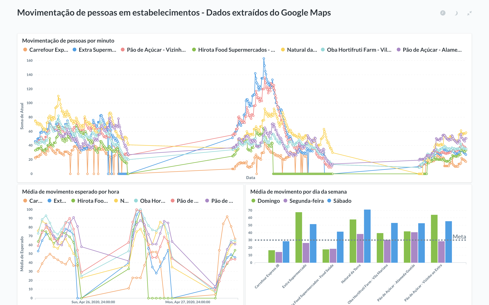
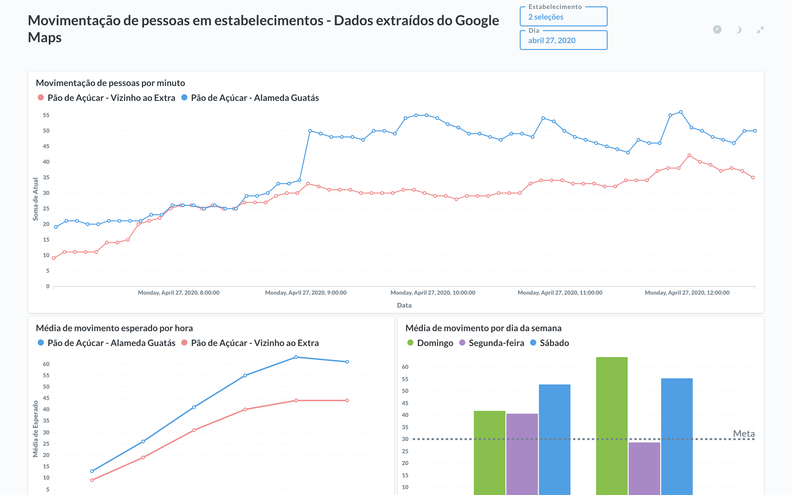

# Extract Google Maps Information

Este repositório ajuda a automatizar a busca de informações sobre a aglomeração de pessoas em estabelecimentos comerciais ou qualquer outro ponto que o Google Maps disponibilize esta informação. Se você precisar sair de casa é posssível planejar com base em dias e horários de menor movimento para os estabelecimentos monitorados.

:warning: Evite sair de casa

### Exemplo de uso

Utilizando a aplicação [Metabase](https://www.metabase.com/) é possível visualizar de forma bastante prática a movimentação de pessoas no decorrer do tempo e comparar quais dias são menos movimentos.

Tenha precisão de informações a cada 5 minutos (ou menos).

